# ACME App

This repo demonstrates the use of Kubernetes and Helm in deploying containerized application.

## 1. Create a HELM chart to deploy the application to Kubernetes
- Create the helm chart using the following command:

```
$> mkdir helm
$> cd helm
$> helm create *name of application*
(in this repo, the name of the application is "devops-a3")
```
- Optional step: There are files that will not be used in the directory generated by Helm, we can remove those files using the following commands:
```
$> cd devops-a3
$> rmdir charts
$> rm -rd templates/*
```
- In the template folder, create a deployment and a service manifest
  - Deployment.yml will include the number of replicas for the kubernetes pods, the path to the image as well as the environment variables to point to the database of said image. These values will be set as variables so we can set them later through circleCI.

    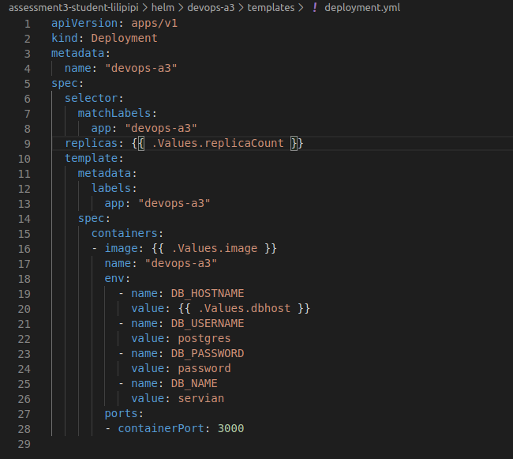

  - Service.yml will include a loadbalancer to allow traffic to the indicated port of the application which is port 3000 in this repo

    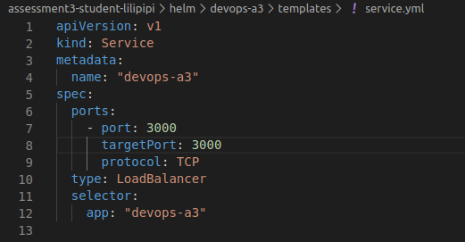

## 2. Deploy the application into a test environment

- In this step, we will automate the deployment of the application by using CircleCI.

- First, we will need to set up the kubernetes cluster using the following commands:

```
$> cd environment
$> make up
$> make kube-up
```

- The kubernetes cluster can take a few minutes to set up. After the cluster is up and running, update the variables inside the infra folder to point to the backend we set up earlier.

- Add the deploy-test job to the circleCI config:

  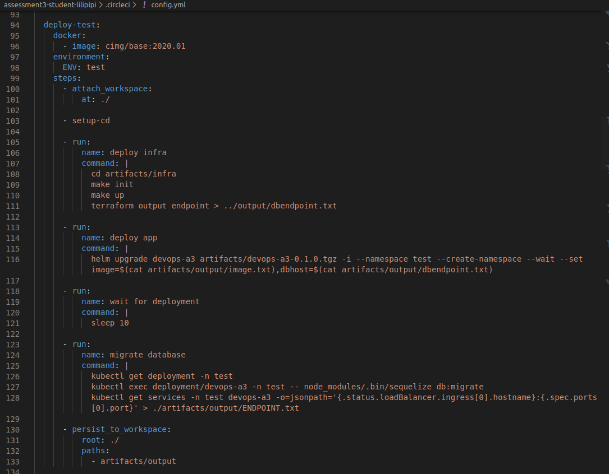

  1. Deploy the database as seen in the deploy infra task.

  2. Deploy the HELM chart using the image uploaded to our deployed ECR and set the database host to the deployed database. We can indicate the namespace where we can deploy the application using the -n flag. The --create-namespace flag will create the namespace for us if the namespace does not exist. In this job, we are deploying the application to our test namespace.

  3. Wait for the kubernetes pods to load the image then migrate the database as seen in the migrate database task.

  4. Save the ENDPOINT to the artifacts/output folder so we can later use it for our tests. This is also where we can see our deployed app in our browser. If the job runs correctly, we can see in our browser:

    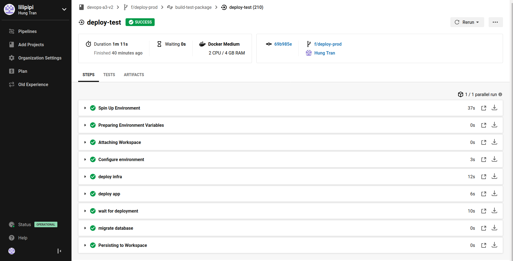

    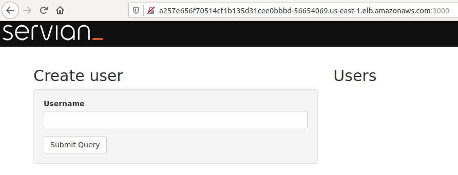

## 3. Run the e2e test against the test environment

- In this step, we will run the e2e test of the app through the deployed HELM chart in the test environment on CircleCI.

  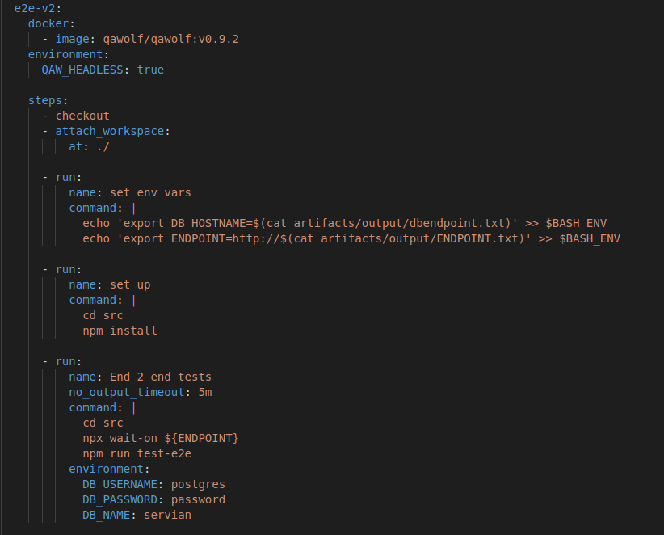

  1. Using the outputs we saved in our artifacts/output folder, we can set the environment variables for our e2e test. Set the DB_HOSTNAME env var to point to our deployed database and the ENDPOINT env var to point to our deployed endpoint in step 2.

  2. Install the dependencies using the command npm install

  3. Run the e2e test with the correct database credentials. If the test runs correctly, we can see it in our circleCI workflow.

    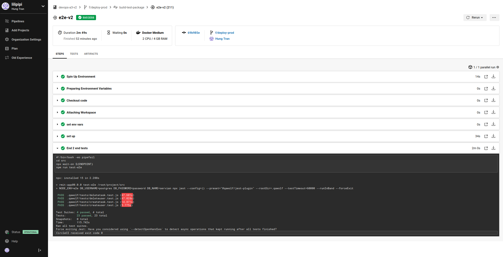

## 4. Deploy the application into a production environment with a stage gate

- After running our tests successfully on the test environment, we are ready to deploy it into our production environment.

  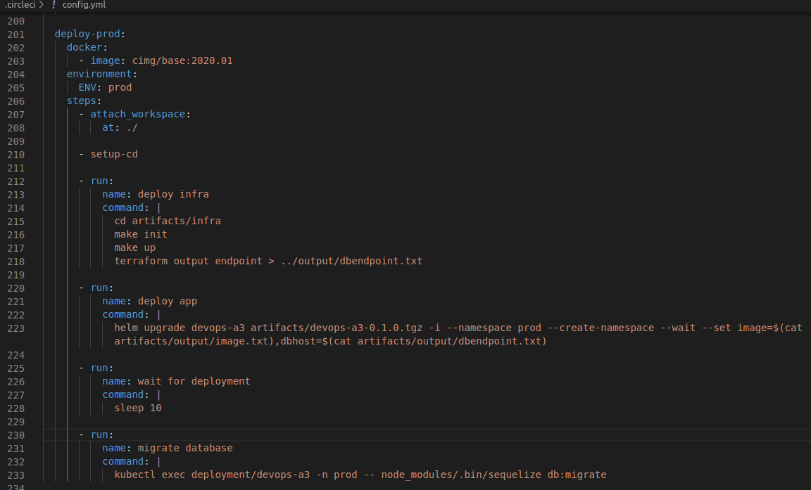

- Change the namespace for kubernetes to deploy on a prod environment instead of test environment. The commands are generally the same as deploying on a test environment.

- Add a stage gate to the workflow to require our approval before proceeding:

  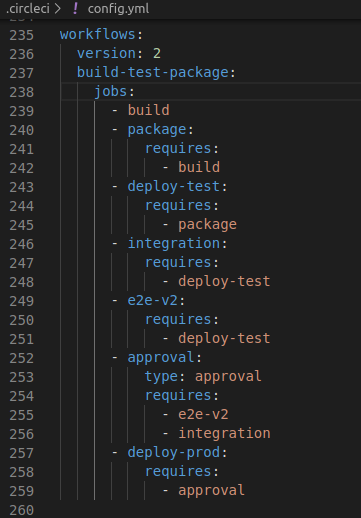

- If all runs correctly, we can see our workflow running successfully in circleCI:

  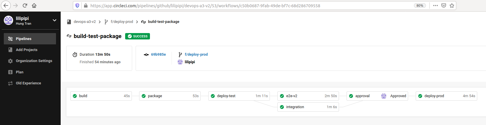

## 5. Integrate logging to the solution so any logs from the Kubernetes cluster is automatically stored in AWS CloudWatch for the future.

- Deploy the fluentd daemon-set to push logs from the kubernetes nodes to AWS cloudwatch

  1. Create a namespace for the cloudwatch

  ```
  $> kubectl create namespace amazon-cloudwatch
  ```

  2. Create a config map for the fluentd service

  ```
  $>kubectl create configmap cluster-info --from-literal=cluster.name=rmit.k8s.local --from-literal=logs.region=us-east-1 -n amazon-cloudwatch
  ```

  3. The code of the fluentd service can be found in the ./fluentd.yaml file. Apply this file.

  ```
  $> kubectl apply -f fluentd.yaml
  ```

  4. We can see the logs from the pods of our deployed application on cloudwatch. The image below shows the logs logged by our application running in the production environment.

  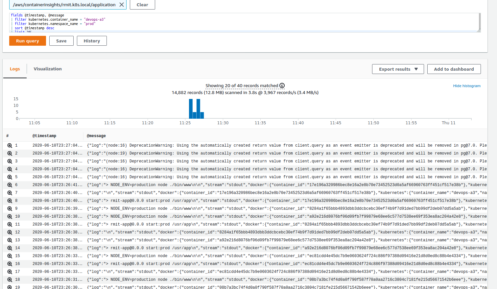


